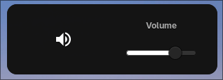
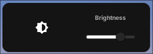

# Hyprland OSDs with Eww

A simple and lightweight **Volume & Brightness OSD** for [Hyprland](https://hyprland.org/) built with [Eww (ElKowar's Wacky Widgets)](https://elkowar.github.io/eww/).

The OSD appears on screen whenever the volume or brightness changes, providing a clean visual indicator without relying on a full desktop environment.

## 📸 Preview

### 🔊 Volume OSD

<p align="center">
  
</p>

### ☀️ Brightness OSD

<p align="center">
  
</p>

## ✨ Features

* 🔊 Volume change OSD
* ☀️ Brightness change OSD
* ⚡ Lightweight and fast
* 🎨 Fully customizable with Eww
* 🐧 Designed for Linux + Hyprland
* 🖥️ Works with keyboard brightness and volume controls
* 🧩 Easy to integrate into an existing Hyprland configuration

## 📦 Requirements

Make sure the following are installed:

* [Hyprland](https://hyprland.org/)
* [Eww](https://elkowar.github.io/eww/)
* `brightnessctl`
* `wpctl` / PipeWire

### Arch Linux

```bash
sudo pacman -S brightnessctl
```

Eww can be installed from the AUR:

```bash
paru -S eww
# or
yay -S eww
```

## 🚀 Installation

Clone the repository:

```bash
git clone https://github.com/Jack02134x/Hyprland-OSDs-eww.git
cd Hyprland-OSDs-eww
```

Copy the Eww configuration to your configuration directory:

```bash
mkdir -p ~/.config/eww
cp -r scripts/ eww.scss eww.yuck ~/.config/eww
```

Start the Eww daemon using hyprland autostart:

```lua
hl.exec_cmd("eww-daemon")
```

> **Note:** The exact widget name may differ depending on the configuration in `eww.yuck`.

## ⌨️ Hyprland Keybinds

Add your volume and brightness keybinds to `hyprland.conf`.

For example:

```lua
# FOR VOLUME --------

hl.bind("XF86AudioRaiseVolume", hl.dsp.exec_cmd("~/.config/eww/scripts/volume.sh up"), { locked = true, repeating = true  }) 
hl.bind("XF86AudioLowerVolume", hl.dsp.exec_cmd("~/.config/eww/scripts/volume.sh down"), { locked = true, repeating = true  }) 
hl.bind("XF86AudioMute", hl.dsp.exec_cmd("~/.config/eww/scripts/volume.sh mute"), { locked = true })

# FOR BRIGHTNESS --------

hl.bind("XF86MonBrightnessUp",   hl.dsp.exec_cmd("~/.config/eww/scripts/brightness.sh up"), { locked = true, repeating = true })
hl.bind("XF86MonBrightnessDown", hl.dsp.exec_cmd("~/.config/eww/scripts/brightness.sh down"),  { locked = true, repeating = true })
```

The OSD scripts can then be triggered alongside these commands.

## ⚙️ Configuration

The appearance of the OSD can be customized through:

```text
eww.yuck
eww.scss
```

You can change things such as:

* OSD position
* Size
* Icons
* Colors
* Fonts
* Progress bar appearance
* Animation
* Display duration

## 📁 Structure

```text
.
├── eww.yuck
├── eww.scss
└── scripts/
    ├── brightness.sh
    └── volume.sh
```

Your exact file structure may differ depending on the version of the configuration.

## 🛠️ Customization

This project is intentionally simple so it can be dropped into an existing Hyprland setup without requiring an entire desktop configuration.

Feel free to modify the Eww widgets and SCSS to match your own rice.
